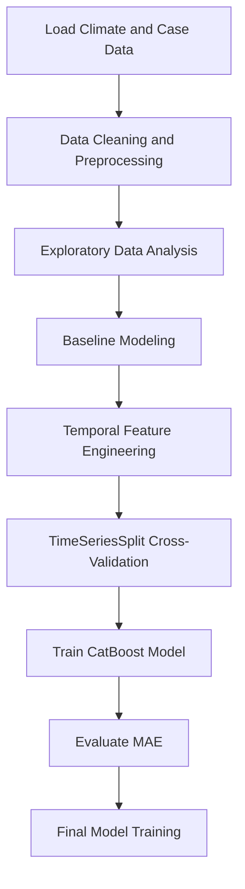

# Dengue Time Series Forecasting

## Introduction

This repository contains a structured machine learning pipeline for forecasting weekly dengue cases in San Juan (Puerto Rico) and Iquitos (Peru) using environmental and temporal features.

The project is based on the DrivenData “DengAI: Predicting Disease Spread” dataset. The primary objective is to predict weekly dengue case counts (`total_cases`) using climate variables and autoregressive temporal features, while maintaining strict chronological validation.

This work focuses on disciplined time-series modeling, proper cross-validation strategy, reproducibility, and practical machine learning engineering rather than experimental or novel research methods.

---

## Features

- Data preprocessing and cleaning tailored to the DengAI dataset.
- Exploratory Data Analysis (EDA) for understanding seasonal patterns and outbreak spikes.
- Baseline regression models (Linear Regression, Random Forest) for performance benchmarking.
- Temporal feature engineering:
  - Autoregressive lags (1–4 weeks)
  - Rolling mean (4 and 8 weeks)
  - Rolling standard deviation
- Log transformation of the target variable for variance stabilization.
- Chronological validation using `TimeSeriesSplit`.
- Final forecasting model using CatBoost Regressor with MAE loss.
- Reproducible Jupyter notebooks covering the complete modeling pipeline.

---

## Requirements

To run this project, ensure you have:

- Python 3.8 or higher
- pip (Python package manager)

Required Python packages (see `requirements.txt`):

- numpy
- pandas
- matplotlib
- seaborn
- scikit-learn
- catboost
- jupyter

---

## Installation

Follow these steps to set up the project locally:

1. Clone the repository:

    ```bash
    git clone https://github.com/hardik-thapar/dengue-time-series-forecasting.git
    cd dengue-time-series-forecasting
    ```

2. (Optional) Create a virtual environment:

    ```bash
    python3 -m venv venv
    source venv/bin/activate  # On Windows: venv\Scripts\activate
    ```

3. Install dependencies:

    ```bash
    pip install -r requirements.txt
    ```

---

## Dataset

The dataset is not included in this repository.

Download the DengAI dataset from the official competition page:

https://www.drivendata.org/competitions/44/dengai-predicting-disease-spread/

After downloading:

- Place the training and test CSV files inside the `data/` directory.
- Follow the structure described in `data/README.md`.

All rights to the dataset belong to DrivenData and the associated data providers.

---

## Usage

After installation:

1. Place the dataset files inside the `data/` directory.
2. Launch Jupyter Notebook:

    ```bash
    jupyter notebook
    ```

3. Run notebooks in the following order:

   - `01_eda.ipynb`
   - `02_baseline_models.ipynb`
   - `03_feature_engineering.ipynb`
   - `04_final_model.ipynb`

Each notebook builds upon the previous one, moving from exploration to final model validation.

---

## Typical Workflow



---
## Results (Cross-Validated)

| City       | Baseline MAE | Final MAE |
|------------|--------------|-----------|
| San Juan   | ~30          | ~11.8     |
| Iquitos    | ~31          | ~4.7      |

Performance improvement was primarily driven by autoregressive lag features and disciplined time-series validation.

---

## License

This repository is licensed under the MIT License.
